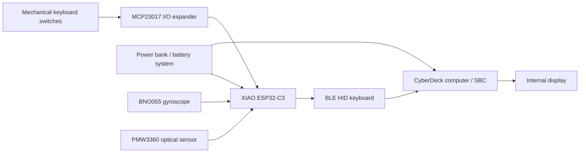

CyberDeck from Radio
A portable cyberdeck built by converting an old radio enclosure into a functional computer with a custom keyboard, custom electronics, display, battery power and a single-board computer.
> **Submission note:** Replace the image placeholders in this README with photographs/renders of the *actual completed build* before submitting this project for review.
Overview
The goal of this project is to reuse the enclosure of an old radio and turn it into a portable computer while designing the mechanical and electronic interfaces around the new hardware.
The project is divided into four main systems:
Compute system — a single-board computer runs the operating system and applications.
Input system — a custom mechanical keyboard is scanned by a dedicated XIAO ESP32-C3 controller through an MCP23017 I/O expander.
Display and power — an internal display is mounted into the original radio opening and the computer is powered from a portable power source.
Mechanical system — custom CAD parts adapt the radio enclosure to the keyboard, electronics, display and mounting hardware.
Final Build
<!-- Replace this file with a real photo/render of the assembled final device: assets/final-model.jpg -->

The cover image for the GitHub repository should use the same real final-build photograph/render, not a concept image.
System Architecture

The ESP32-C3 is used as a dedicated input controller rather than making the main computer scan every switch itself. This keeps the keyboard scanning logic separate from the main operating system.
Hardware
Part	Purpose	Status / note
XIAO ESP32-C3	Keyboard controller	Used for keyboard scanning and BLE HID
MCP23017	16-bit I/O expander	Provides the GPIO used by the keyboard matrix
Mechanical switches	Keyboard input	Custom keyboard
Keycaps	Physical key interface	Custom keyboard
Single-board computer	Main computer	Choose one final platform and use it consistently in the docs
Internal display	Main visual output	Mounted in the radio enclosure
Power bank / battery system	Portable power	Verify final power wiring before publication
BNO055	Motion sensor	Mentioned by the build instructions; verify final assembly
PMW3360	Optical motion sensor	Mentioned by the build instructions; verify final assembly
Custom PCB	Keyboard/electronics board	Document the actual board revision used
Important hardware consistency check
The original repository currently mentions a Radxa X4 as the main computer in the README, while the BOM also contains a LattePanda IOTA N150 and RAM/storage parts. Before the final submission, pick the computer actually installed in the finished build and update the README, instructions, CAD and BOM so they all describe the same hardware.
Keyboard Electronics
Why use an ESP32-C3?
The main computer is responsible for running the operating system and applications. The ESP32-C3 is instead dedicated to reading the physical keyboard and handling the input-side firmware.
The MCP23017 is a 16-bit I/O expander connected over I2C. It lets the controller access more matrix lines than would be convenient using only the ESP32-C3's local GPIO.
The XIAO ESP32-C3 exposes I2C on D4/GPIO6 (SDA) and D5/GPIO7 (SCL) on the current Seeed pin map. citehttps://wiki.seeedstudio.com/XIAO_ESP32C3_Getting_Started/
```text
Keyboard switches
       |
       v
+------------------+
| Keyboard matrix  |
+------------------+
       |
       v
+------------------+       I2C       +------------------+
|   MCP23017       | <--------------> | XIAO ESP32-C3    |
| 16-bit GPIO exp. |                  | firmware         |
+------------------+                  +------------------+
                                             |
                                             v
                                      BLE HID keyboard
                                             |
                                             v
                                       Main computer
```
Matrix scanning
A keyboard matrix reduces the number of connections needed for many switches by arranging them in rows and columns. The firmware drives one row at a time and reads the column states. When a switch joins the selected row to a column, the firmware records that key as pressed.
The exact row/column mapping must match the actual PCB schematic. The firmware included in this package therefore keeps the mapping in one clearly marked configuration section instead of hiding the pin assignments throughout the code.
Schematic Documentation
Add these images from KiCad before submitting:
`assets/schematic-overview.png` — complete schematic
`assets/schematic-keyboard.png` — keyboard matrix and controller section
`assets/schematic-power.png` — power section
`assets/schematic-sensors.png` — sensor section, if the sensors are installed
For each image, add 2–4 sentences describing what the section does and why the components are connected that way.
What to explain
MCP23017 section
Explain that the MCP23017 communicates with the XIAO ESP32-C3 over I2C and exposes the GPIO used by the keyboard matrix.
Keyboard matrix section
Explain the row/column arrangement and the function of the switch diodes. The diode orientation must match the actual schematic/PCB silkscreen.
Sensor section
If the BNO055 and PMW3360 are part of the final build, document their actual buses, addresses, power voltage and interrupt/data lines from the final schematic.
Power section
Document the actual battery/power-bank output, any regulators or protection circuitry, and which subsystem receives which voltage.
PCB Design
The PCB source should be kept in the repository together with its KiCad schematic and board file.
Recommended screenshots:


PCB design goals
Keep the keyboard matrix wiring organized.
Keep I2C connections short and easy to inspect.
Provide accessible mounting holes.
Label connectors and important signals on silkscreen.
Make the board easy to assemble and troubleshoot.
Firmware
Firmware lives in `firmware/`.
Important USB detail
The ESP32-C3's integrated USB interface is USB Serial/JTAG and CDC, not a reconfigurable USB HID interface. Espressif's documentation explicitly states that the ESP32-C3 supports USB CDC and JTAG, while USB HID device support is available on ESP32-S2/S3. citeturn643326search0turn643326search2
For the current XIAO ESP32-C3 hardware, the firmware in this repository uses Bluetooth Low Energy HID for the keyboard connection. The XIAO ESP32-C3 supports Bluetooth LE, and current BLE-HID libraries support ESP32-C3. citeturn656599view0turn810315view0
If the finished PCB is required to behave as a wired USB HID keyboard, the controller should instead be changed to a USB-HID-capable ESP32-S2/S3-class device and the hardware design must be updated accordingly.
Firmware responsibilities
The firmware is responsible for:
initializing I2C;
initializing the MCP23017;
scanning the keyboard matrix;
debouncing switch transitions;
translating matrix positions into keyboard actions;
advertising/pairing as a BLE HID keyboard; and
reporting input to the host.
CAD / Mechanical Design
The CAD model should show the complete physical assembly, not just an empty shell.
Recommended assembly contents:
original radio enclosure;
display and display bracket;
keyboard plate and switches;
keyboard PCB;
XIAO ESP32-C3;
main computer/SBC;
battery/power-bank location;
mounting bosses/screws;
cable routing;
ventilation openings;
external connectors and controls;
any mouse/trackball/optical-sensor hardware actually used.
Mechanical requirements before final submission
Increase enclosure wall thickness to a clearly manufacturable value appropriate for the printing method.
Add screw bosses and mounting points where parts need to be secured.
Add openings for every connector that must be accessible from outside the case.
Add ventilation around heat-producing electronics.
Add mechanical details/design features so the enclosure looks intentionally designed rather than like a plain box.
Insert simplified electronic models into the assembly so a reviewer can understand the internal layout.
STEP Files
Export the final mechanical parts and the complete assembly to STEP and place them in `cad/step/`.
Recommended exports:
```text
cad/step/
├── final_assembly.step
├── enclosure.step
├── keyboard_plate.step
├── keyboard_case.step
└── mounting_parts.step
```
Assembly
The final assembly should be documented with photos showing the progression from subassemblies to the complete device.
```text
PCB assembly
    ↓
Keyboard assembly
    ↓
Electronics mounted in case
    ↓
Display installed
    ↓
Power and signal wiring
    ↓
Final enclosure closed
    ↓
Boot/test
```
Testing
Record the results of these tests before final submission:
Test	Result	Evidence
ESP32-C3 powers on	TODO	Photo/video
MCP23017 detected on I2C	TODO	Serial log
Every keyboard key works	TODO	Key test
BLE keyboard pairs	TODO	Host screenshot
Display works	TODO	Photo
Main computer boots	TODO	Photo
Power system works safely	TODO	Test notes
Final enclosure fits	TODO	Final photo
Sensors work (if installed)	TODO	Serial/test result
Bill of Materials
The existing `bom.csv` contains the component list and purchase links. Clean it up before submission so that it only contains the actual parts used by the final build, with correct quantities and prices.
In particular, reconcile the current computer choice and verify that the sensor and PCB parts listed in the build instructions also appear in the BOM when they are actually used.
Repository Structure
```text
cyberdeck_from_radio/
├── README.md
├── instructions.md
├── bom.csv
├── firmware/
│   ├── platformio.ini
│   ├── README.md
│   └── src/
│       └── main.cpp
├── docs/
│   ├── SCHEMATIC_GUIDE.md
│   ├── CAD_AND_RENDER_GUIDE.md
│   └── FINAL_SUBMISSION_CHECKLIST.md
├── assets/
│   ├── final-model.jpg
│   ├── schematic-overview.png
│   ├── schematic-keyboard.png
│   ├── pcb-front.png
│   ├── pcb-back.png
│   └── pcb-3d.png
├── cad/
│   └── step/
└── Footprints_and__libraries/
```
Current Limitations / Next Steps
The final version should only mark a feature as complete after it has been physically tested. Hardware that is planned but not installed should remain clearly labelled as planned.
Credits
Built as an independent hardware project using KiCad for electronics design, CAD software for the mechanical design, and embedded firmware for the custom input controller.
References
Seeed Studio XIAO ESP32-C3 documentation — board pin map and BLE capability. citeturn656599view0
Espressif ESP32-C3 documentation — USB Serial/JTAG and CDC limitations. citeturn643326search0turn643326search2
Adafruit MCP23017 Arduino documentation — I2C GPIO-expander usage. citeturn643326search7
